# Predicting House Prices

## Introduction:
### 1. Project Overview:
The purpose of this project is to predict the sales price for each house. For each ID in the test set, I predicted the value of the SalePrice variable and submitted it to Kaggle. This project submission is evaluated based on the Root Mean Squared Error (RMSE) between the logarithm of the predicted value and the logarithm of the observed sales price. The goal was to achieve a score in the top 25%, and my Logarithmic RMSE (LOG RMSE) score was 0.13149. 

### 2. Dataset Description:
The training and test datasets provided by Kaggle include a total of 1,460 observations. The training set has 80 features (including SalePrice), while the test set has 79 features (excluding SalePrice). This dataset contains a mix of numerical and categorical data, which is useful for predicting SalePrice.

## Exploratory Analysis (EDA):
### 1. Data Overview: 
The first table in the eda portion of the main notebook [text](House_prices_regression_project.ipynb) shows the head of the training dataset, while the second table shows the statistics for each feature.  The second table includes information such as the mean, standard deviation, minimum value, first quartile, median (second quartile), third quartile, and maximum value. These statistics are important for understanding the overall distribution of the data without examining it in excessive detail.

The following image shows the distribution of all numerical features along with the skewed values. These values and graphs helped determine how I would impute the features with null values.
Id                0.000000
MSSubClass        1.407657
LotFrontage       2.163569
LotArea          12.207688
OverallQual       0.216944
OverallCond       0.693067
YearBuilt        -0.613461
YearRemodAdd     -0.503562
MasVnrArea        2.669084
BsmtFinSF1        1.685503
BsmtFinSF2        4.255261
BsmtUnfSF         0.920268
TotalBsmtSF       1.524255
1stFlrSF          1.376757
2ndFlrSF          0.813030
LowQualFinSF      9.011341
GrLivArea         1.366560
BsmtFullBath      0.596067
BsmtHalfBath      4.103403
FullBath          0.036562
HalfBath          0.675897
BedroomAbvGr      0.211790
KitchenAbvGr      4.488397
TotRmsAbvGrd      0.676341
Fireplaces        0.649565
GarageYrBlt      -0.649415
GarageCars       -0.342549
GarageArea        0.179981
WoodDeckSF        1.541376
OpenPorchSF       2.364342
EnclosedPorch     3.089872
3SsnPorch        10.304342
ScreenPorch       4.122214
PoolArea         14.828374
MiscVal          24.476794
MoSold            0.212053
YrSold            0.096269
SalePrice         1.882876
dtype: float64

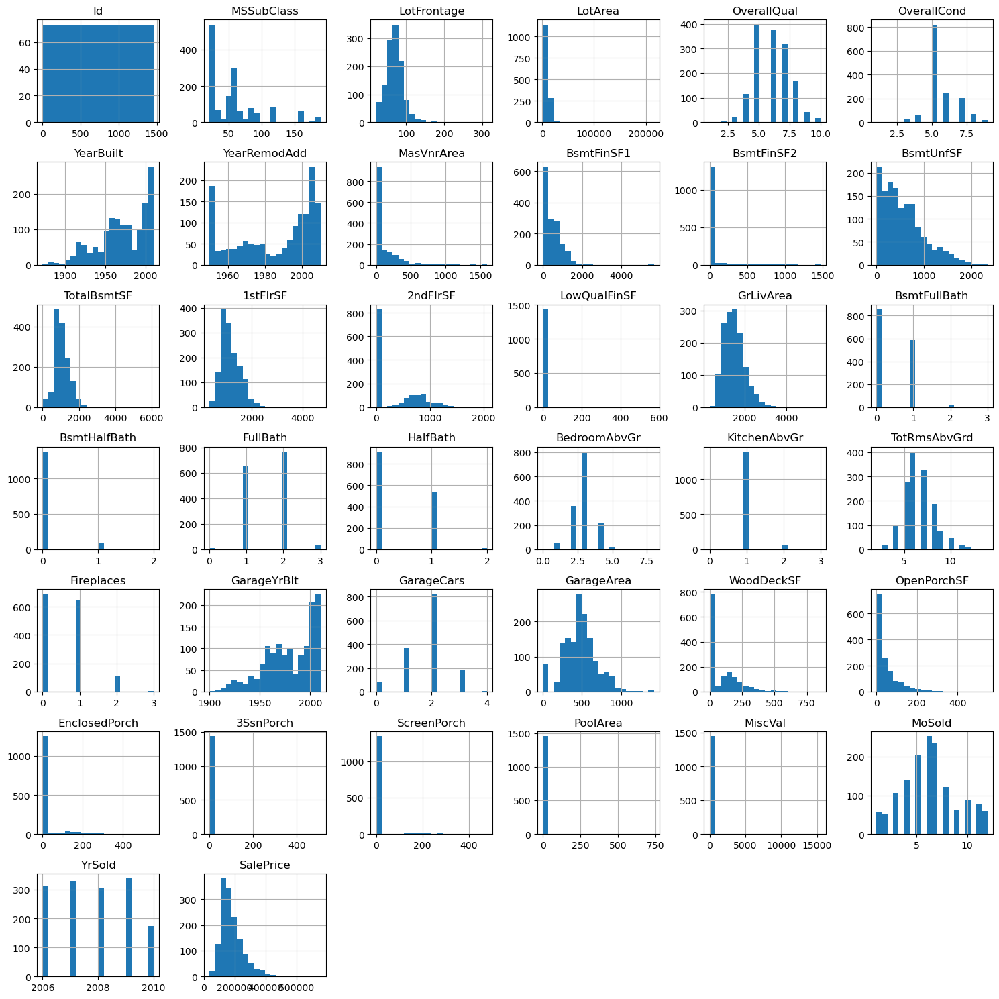

### 2. Missing Values Analysis:
When dealing with missing values, you often have to ask yourself: How should you impute the values to create an accurate model? And when is it okay to impute to 'None' or 0?

Based on the EDA portion, I chose median imputation for features like 'LotFrontage' and 'GarageYrBlt' because 'LotFrontage' was highly skewed (i.e., contains outliers and is not normally distributed) and 'GarageYrBlt' was moderately skewed. Generally, it’s better to impute using the median when a feature is moderately skewed, because imputing by mean could still introduce bias into the data. There was only one numerical feature that I chose to impute to 0: 'MasVnrArea'.

The categorical features with missing values were: 'MasVnrType', 'BsmtQual', 'BsmtCond', 'BsmtExposure', 'Electrical', 'FireplaceQu', 'GarageType', 'GarageFinish', 'GarageQual', 'GarageCond', and 'MiscFeature'. For some of these categorical variables, I chose to impute with the mode, while others were set to 'None'. The features I imputed with the mode were: 'MasVnrType', 'BsmtExposure', and 'Electrical'. The features I imputed with 'None' were: 'BsmtFinType2', 'BsmtFinType1', 'GarageType', 'GarageFinish', 'GarageQual', 'GarageCond', 'BsmtQual', 'BsmtCond', 'FireplaceQu', and 'MiscFeature'.

The features I decided to drop from both the training and test datasets due to the high amount of missing values were: 'Alley', 'PoolQC', and 'Fence'. I reached this conclusion by examining the training dataset information and evaluating the missing value percentages for these features.

The additional features I had to impute in the test set and the methods I used were:
 -Mode: 'MSZoning', 'Exterior1st', 'Exterior2nd', 'BsmtFullBath', 'BsmtHalfBath', 'KitchenQual', 'Functional', 'GarageCars', 'SaleType'
 - Mean: 'GarageArea'
 - Median: 'BsmtFinSF2', 'BsmtFinSF1', 'BsmtUnfSF'. 

### 3. Target Variable Analysis:
These two plots show the analysis of the target variable, SalePrice.

#### Boxplot:
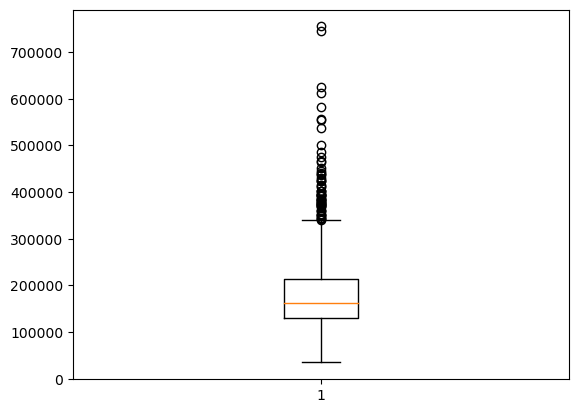 

#### Histogram:
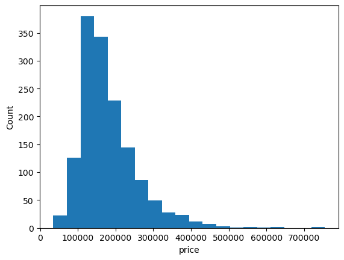

Individual statistics of SalePrice:
count      1460.000000
mean     180921.195890
std       79442.502883
min       34900.000000
25%      129975.000000
50%      163000.000000
75%      214000.000000
max      755000.000000
Name: SalePrice, dtype: float64

First, we can see from the boxplot for SalePrice that the median is approximately between $160,000 and $170,000. The interquartile range (IQR) represents 50% of the data, which lies between the first quartile (Q1) and the third quartile (Q3). Based on the boxplot, the house price range spans approximately from $130,000 to $210,000. It is also evident that the outliers are below $30,000 and above $700,000. This is confirmed by the statistics for SalePrice, where Q1 is $129,975 and Q3 is $163,000. With the values of Q1 and Q3, we can calculate the IQR as follows:
    IQR = Q3 - Q1 = 210,000-120,000 = $80,000.
Additionally, the histogram shows that the data is highly skewed to the right.

### 4. Feature Correlation:
The following images show the correlations between features and how strongly they relate to each other. This information is useful for determining how to handle the features when the goal is to reduce dimensionality. The first image displays the correlations of all features with one another, while the second one highlights only the strong correlations.

#### Heatmap with all features:
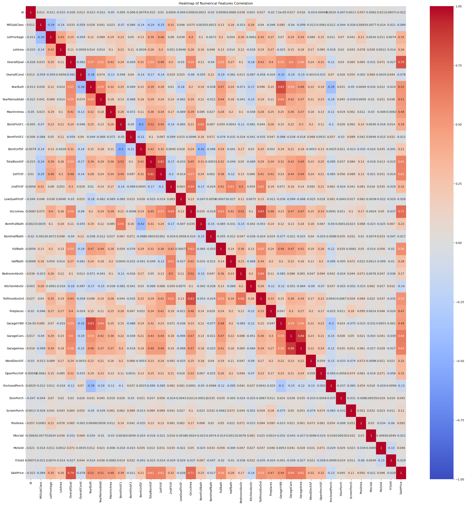
#### Heatmap highlighting the important features:
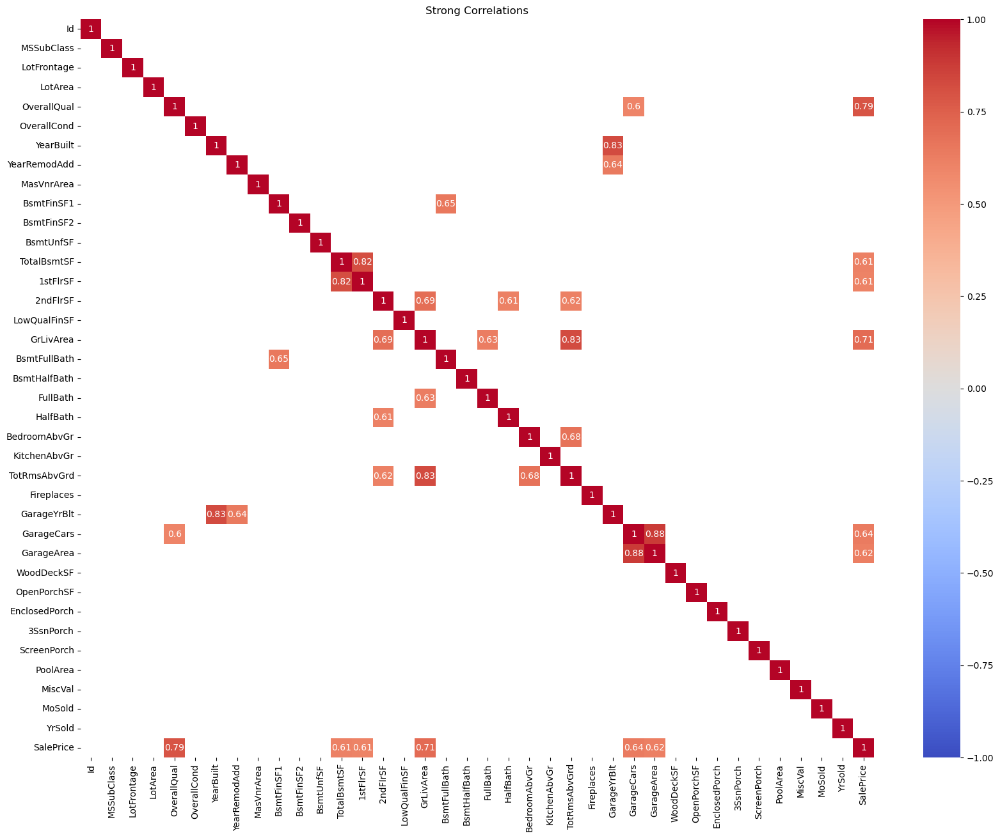

These values and this bar plot show the top 10 features correlated with the target variable, SalePrice, ranked from the highest to the lowest correlation.

SalePrice       1.000000
OverallQual     0.790982
GrLivArea       0.708624
GarageCars      0.640409
GarageArea      0.623431
TotalBsmtSF     0.613581
1stFlrSF        0.605852
FullBath        0.560664
TotRmsAbvGrd    0.533723
YearBuilt       0.522897
Name: SalePrice, dtype: float64

#### Top 10 Correlated Features with SalePrice:
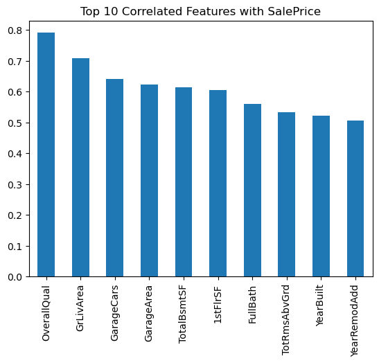

Based on both the heatmap and the bar chart, we can infer how the features rank, from the most important to the least, as follows:
1. Highly Important:
    - OverallQual: 0.79 
    - GrLivArea: 0.71
2. Moderately Important:
    - Garagecars: 0.64
    - GarageArea: 0.62
    - TotalBsmtSF: 0.61
    - 1stFlrSF: 0.61
    - FullBath: 0.56
    - TotalRmsAbvGrd: 0.53
    - YearBlt: 0.52
    - YearRemodAdd: 0.51

### 5. Key Observations:
Before discussing the plots and their meanings, some key observations I noticed were that, even though 'Utilities' had no null values, I decided to drop it from both the training and testing sets because of its value counts. As shown below, 'Utilities' has very low variance, with almost all values being the same, which makes it unlikely to be beneficial to the model.

Utilities:
- AllPub: 1459
- NoSeWa: 1
dtype: int64 

Based on the plots above, we could explore the selected features further by examining count plots, box plots, and scatter plots.

#### Count plot for the OverallQual Distribution:
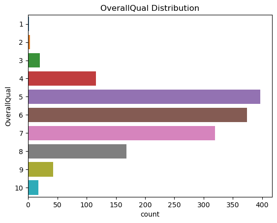

#### Boxplot of SalePrice by OverallQual:
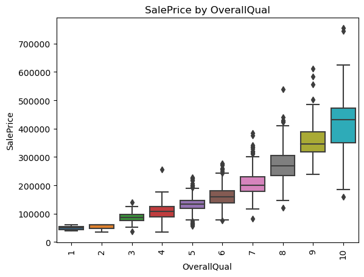

This horizontal bar plot of OverallQual shows the distribution of each rating score in the dataset. This feature represents each home's overall quality rating on a scale from 1 to 10, where 1 denotes very poor quality and 10 denotes extraordinary quality. The distribution indicates that the most common values are between 5 and 6, suggesting these ratings are the most frequently used in the dataset.

The behavior of the OverallQual feature in relation to the SalePrice target variable is shown in the box plot. We observe a clear pattern where better overall quality is associated with higher prices, indicating a positive correlation between OverallQual and SalePrice. The outliers are more scattered for ratings between 8 and 10 than for ratings between 1 and 3.

#### Count plot for FullBath variable:
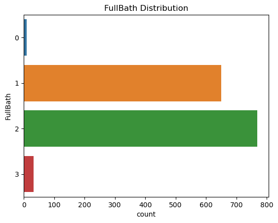

#### Boxplot of SalePrice by FullBath:
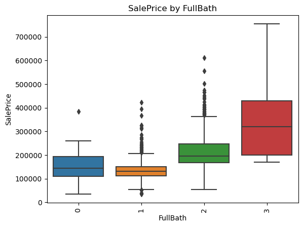

#### Count plot for HalfBath variable:
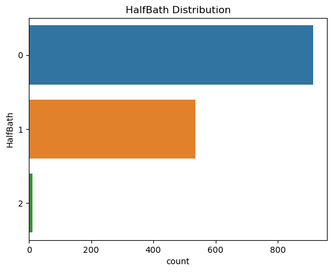

#### Boxplot of SalePrice by HalfBath:
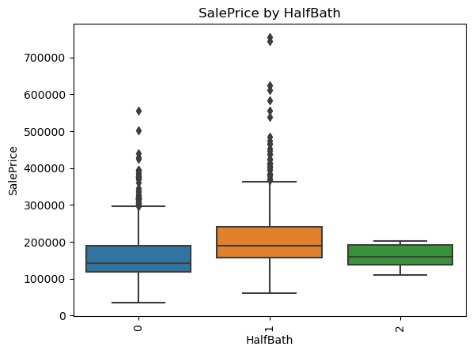

The distribution of the FullBath and HalfBath features, which indicate the number of full and half bathrooms in the dataset, is displayed in the horizontal bar graphs. According to the FullBath plot, most homes have either one or two complete bathrooms, with two being the most common. The HalfBath plot, on the other hand, shows that most homes lack half bathrooms (0).

Houses with more full bathrooms tend to have higher prices, according to the first box plot. However, a less clear trend is observed in the second box plot for half bathrooms. The most outlier-prone values for full bathrooms are 1 and 2, with outliers for 2 being more dispersed than those for 1. Outliers are more common for half bathrooms at 0 and 1, with outliers for 1 being more widely distributed. We also see that outliers for homes with three full bathrooms tend to lean toward higher values.

#### Count plot for a TotRmsAbvGrd variable:
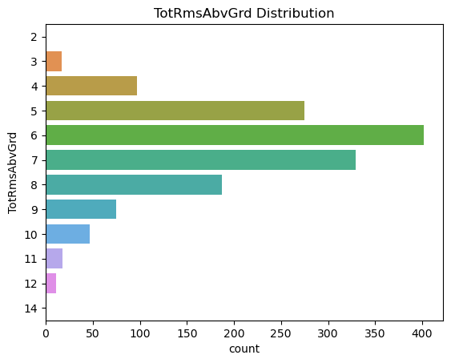

#### Boxplot of SalePrice by TotRmsAbvGrd:

The distribution of the total rooms above grade (TotRmsAbvGrd, excluding bathrooms) is shown in the count plot. While fewer homes have between 9 and 12 rooms or just 3 rooms, the majority of observations fall in the 6–7 room range.

The box plot clearly shows that SalePrice tends to increase with the number of rooms. However, a noteworthy feature is the presence of outliers, particularly in the lower room ranges. This suggests that other factors besides room count may influence the price of homes with fewer rooms.

The next four subplots show the relationships between SalePrice and the following features: 

#### GrLivArea, TotalBsmtSF, 1stFlrSF, and GarageArea:
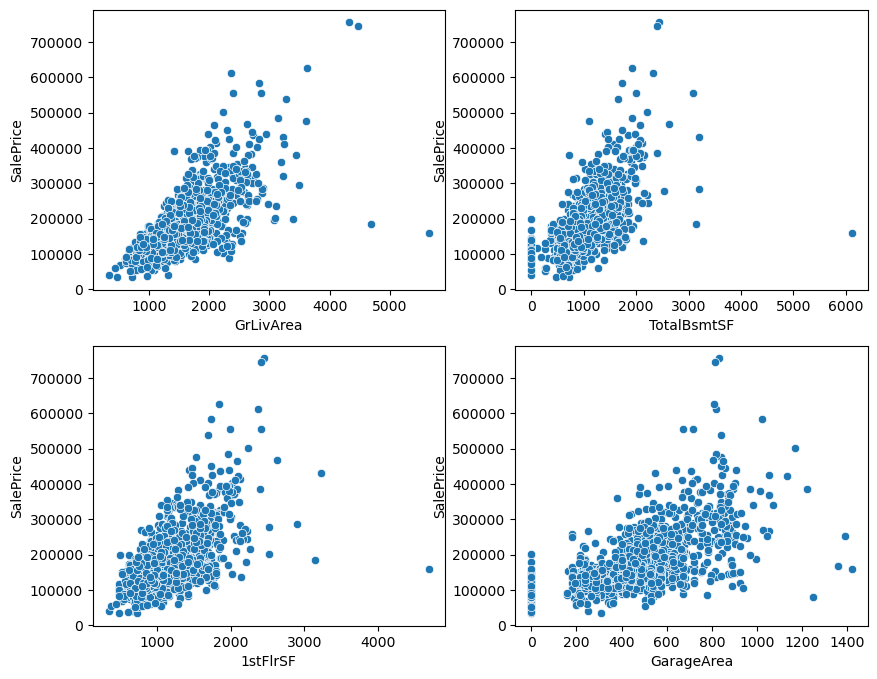

The four scatter plots demonstrate how certain factors affect the target variable by showing the relationship between SalePrice and these features. All of these graphs show a positive correlation, meaning that SalePrice tends to rise with each feature's value. However, each plot presents a different perspective.

Plot 1: The first scatter plot shows the relationship between Above Grade (Ground) Living Area (GrLivArea) and SalePrice. A few outliers are visible, where homes have a large living area but still a relatively low SalePrice.

Plot 2: The second plot displays the relationship between Total Basement Area (TotalBsmtSF) and SalePrice. It highlights that some homes lack basements, suggesting that having a basement may have a significant impact on the sale price.

Plot 3: The third plot, which focuses on First Floor space (1stFlrSF), displays outliers where SalePrice does not rise as expected, even for homes with floor space ranging from 3,000 to over 4,000 square feet. This suggests that other factors may significantly influence the price of these homes.

Plot 4: The final plot looks at Garage Area. Similar to the second plot, it suggests that the presence of a garage may impact the sale price, as not every home has one.

## Data Preprocessing:
The overall steps that I applied throughout the main notebook [text](House_prices_regression_project.ipynb), are organized into sections:
    1. Importing all libraries that will be used throughout the notebook.
    2. Data Ingestion for the training set.
    3. General EDA --> Main Notebook
    4. Data Wrangling --> Python file
    5. Feature Removal --> Main Notebook
    6. Feature Engineering --> Python file
    7. Encoding --> Python file
    8. Splitting the training set to evaluate the model before prediction --> Main Notebook.
    9. Following Steps 4-7 for the testing dataset. 

The separate Python file contains a more detailed, step-by-step process for preprocessing before modeling. The Python file is organized into sections, with each section representing a preprocessing step I implemented when calling the file and its functions from the main notebook. The first section of the file imports all libraries used both in the notebook and in the Python file.

### Section 2:
    4. Data Wrangling:
The second section deals with handling missing values for both the training dataset and the testing dataset. Although there are some extra features in the testing dataset that needed to be imputed, these are handled in the notebook, as those features are only imputed in the test dataset, not the training dataset.

### Section 3:
    6. Feature Engineering:
The third section focuses on feature engineering and describes which features I decided to combine in order to reduce dimensionality. Some of these features were combined based on logic, while others were combined due to their correlation with the target variable. To go into more detail:
    - Combining these features: 'TotalBsmtSF' + '1stFlrSF' + '2ndFlrSF' to create a new feature, 'TotalSF'. The logic behind this is that instead of looking at the basement and floor areas separately, I aggregated them into total square footage because it better captures the overall size of the house.
    - Combining the total number of bathrooms in a house can indicate how the house is laid out and can serve as a good predictor for SalePrice. Aggregating these small correlations can benefit the model, as the new feature will have a higher correlation with the target variable.
    - The combination of various porch areas (in square feet) can help capture the total outdoor space, which is also correlated with the target variable, improving the model’s prediction.
    - Combining 'YrSold' - 'YearBuilt' to create 'Age' can benefit the model, as it correlates with the overall outdatedness or depreciation of the house's style and materials.
    - Although combining 'YrSold' - 'YearRemodAdd' to create 'AgeRemod' is somewhat similar to 'Age,' it provides additional insights into how remodeling affects the house's price, as modern and up-to-date repairs can lead to price increases. By including both features, we consider both the base age of the house and the impact of its repairs independently, as both can significantly influence the sale price. This distinction is important because repairs are often small, and without considering both features, the full extent of the renovation would not be captured.
    - Lastly, combining 'OverallQual' and 'OverallCond' seems logical since they appear to be similar, and their combined correlation with SalePrice increases, making them important when combined.

In summary, I chose to combine these features both based on logic and correlation with the target variable. High correlations with these engineered features can have a significant impact on the model when compared to SalePrice. After combining these features, the following features were dropped: 'TotalBsmtSF', '1stFlrSF', '2ndFlrSF', 'FullBath', 'HalfBath', 'BsmtFullBath', 'BsmtHalfBath', 'OpenPorchSF', '3SsnPorch', 'EnclosedPorch', 'ScreenPorch', 'WoodDeckSF', 'YrSold', 'YearBuilt', 'YearRemodAdd', 'OverallQual', 'OverallCond'.

### Section 4:
    7. Encoding:
This final section of the Python file outlines the methods used to encode the categorical variables for both the training and testing datasets. The encoding methods I used include ordinal encoding, target encoding, one-hot encoding, and the .map function for 'CentralAir'.

#### Ordinal Encoding:
The features I used for ordinal encoding were: 'LotShape', 'LandSlope', 'ExterQual', 'ExterCond', 'BsmtQual', 'BsmtCond', 'BsmtExposure', 'BsmtFinType1', 'BsmtFinType2', 'HeatingQC', 'KitchenQual', 'FireplaceQu', 'GarageQual', and 'GarageCond'. These features have values that represent a ranking order. This is valuable when considering better conditions and higher quality, which can influence the SalePrice. For example, features like 'ExterQual', 'ExterCond', 'BsmtQual', 'BsmtCond', 'HeatingQC', 'KitchenQual', 'FireplaceQu', 'GarageQual', and 'GarageCond' have quality levels that range from Excellent (Ex) to Poor (Po). This ranking helps predict the sale price: for instance, a kitchen quality of 5 (Excellent) would likely result in a higher price compared to a quality of 3 (Average). Additionally, 'LotShape' and 'LandSlope' describe the lot's regularity and slope, which affect the usability and desirability of the lot, potentially influencing SalePrice. Features like 'BsmtExposure', 'BsmtFinType1', and 'BsmtFinType2' have a natural progression, where they can be ranked based on quality or desirability. For instance, 'BsmtFinType1' and 'BsmtFinType2' describe the basement's finish, with quality ranging from GLQ (Good Living Quarters) to Unf (Unfinished), while 'BsmtExposure' refers to basement exposure to sunlight, with better exposure being more desirable.

After performing ordinal encoding, some columns had null values. I handled this by using the impute_train and impute_test functions, and for imputation, I used the choose_imputation_strategy function for both.

#### Target Encoding:
The features I used for target encoding are: 'Neighborhood', 'Condition1', 'Condition2', 'Functional', and 'MiscFeature'. These features were selected due to their large number of unique categories or their relationship with the target variable, SalePrice. For example, 'Neighborhood' has many unique categories, so target encoding helps capture the influence of each neighborhood on property values based on market trends. Similarly, 'Condition1' and 'Condition2' can directly impact SalePrice because proximity to certain features (such as parks or busy streets) affects desirability. Features like 'Functional' and 'MiscFeature' were also selected because they represent non-ordinal aspects that impact property value. 'Functional' describes the home’s operational condition (e.g., "Typical Functionality" to "Salvage Only"), and target encoding captures the financial impact of each level. 'MiscFeature' includes unique property features (e.g., elevator, second garage) that influence property values differently. Target encoding allows the model to understand the financial effect of these features, enhancing predictive accuracy.

#### One Hot Encoding:
The features I used for one-hot encoding were: 'MSZoning', 'Street', 'LandContour', 'LotConfig', 'BldgType', 'HouseStyle', 'RoofStyle', 'RoofMatl', 'Exterior1st', 'Exterior2nd', 'MasVnrType', 'Foundation', 'Heating', 'Electrical', 'GarageType', 'GarageFinish', 'PavedDrive', 'SaleType', and 'SaleCondition'. These features have manageable categories that do not have inherent order, making them ideal for one-hot encoding. These are nominal data, and encoding them this way ensures that each category is treated independently without introducing ordinality. For example, 'HouseStyle' and 'RoofStyle' represent distinct categories (e.g., home layout, roof type), and since these categories do not have a rank order, one-hot encoding ensures each is treated as an independent feature.

    8. plitting the training set to evaluate the model:
The data was split to train the model by using 'SalePrice' as the target variable (y) and dropping it for the feature set (X). The test size for this split was 0.25, meaning 25% of the dataset was used for the test set.

    9. Following Steps 4-7 for the testing dataset:
For the testing dataset, I followed the same preprocessing steps as for the training dataset, from data wrangling to encoding. As mentioned in the data wrangling section, there were additional columns with null values in the testing dataset, which I handled in the main notebook rather than the Python file, as these columns were not missing in the training set. Some functions used for the testing dataset were different from those used for the training dataset. For the testing dataset, the functions that differed were: impute_test, target_encode_test, and one_hot_encode_test, while for the training dataset, I used: impute_train, target_encode_train, and one_hot_encode_train. The difference in encoding functions arises because, for the training set, we fit and transform the features, whereas for the testing set, we only transform them. Regarding the imputation functions, after performing ordinal encoding, some null values were introduced, which I handled using different imputation strategies for the training and testing datasets. The imputation function for the training set saves how the features were imputed during the fit process, which is then applied to the test set.

## Modeling:
The Logrithmic RMSE (LOG RMSE) scores for the three distinct model types and their corresponding parameters are compared in the table below. The models under evaluation include XGBoost, Linear Regression, and Neural Networks. LOG RMSE is used to assess each model's performance. The purpose of this research is to evaluate the models' performance in predicting home prices by minimizing LOG RMSE, a widely used statistic for comparing predicted and actual values.

| Type of Model    | Score: RMSE  | Parameters
|------------------|--------------|------------
| Linear Regression| 0.18864      | Basic Linear Regression
| Neural Networks  | 0.18494      | 3 dense layers: 24, 64, 1 with input_dim=151
| XGBOOST          | 0.13149      | Indepth parameters.

1. Linear Regression: Based on the table, the LOG RMSE seems to be higher than the rest since this linear regression model appears to be basic. Linear regression models assume a linear relationship between the independent and dependent variables, meaning they attempt to fit a straight line to the data. This assumption holds in the case of simple and multiple linear regression models, excluding any variations such as polynomial regression.

2. Neural Networks: Neural networks provide a slightly better LOG RMSE score than linear regression but do not outperform XGBOOST. Even though both XGBOOST and neural networks have flexibility in capturing non-linear relationships in the data, after trying multiple parameters in XGBOOST, I concluded that I should stick with XGBOOST since, based on the parameters of the neural networks and score, we can see that neural networks are more far off compared to XGBOOST.

3. XGBOOST: This method outperformed the other two models since the parameters were more in-depth. This approach handles a complex relationship between each feature and its target within its data. When it comes to house price predictions, we can say that this method seems to have less computation cost compared to neural networks; therefore, when working on this project, I decided to explore XGBOOST more. The parameters used for this model were:
params = {
    'objective': 'reg:squarederror', # learning task
    'eval_metric': 'rmse', # root_means_squared
    'eta': 0.01,  # learning rate
    'max_depth': 6,  # Max depth of a tree
    'subsample': 0.8,  # controls the fraction of the training data to be randomly sampled
    'colsample_bytree': 0.8,  # the fraction of feature to be randomly sampled for each tree
    'min_child_weight': 2,  # controls the min sum of instance weight 
    'gamma': 0.2,  # Min loss reduction required to make a further partition on a leaf node. 
    'reg_alpha': 0.5, # L1 regularization term on weights. 
    'reg_lambda': 0.5, # L2 regularization term on weights. 
    'seed': 42 # random seed for reproducibility, this ensures the result to be consistent across different runs of the model.
}

## Conclusion: 
For this project, I developed an XGBoost model to predict property prices using various dataset features. I began by classifying the data and handling missing values with different imputation methods. Feature engineering techniques, including dimensionality reduction and encoding categorical variables (one-hot, target, ordinal), were applied to improve performance.

The XGBoost model was fine-tuned during training, and it achieved a validation LOG RMSE of 0.1218. The model's Kaggle score was 0.13149. During EDA, I identified the top 10 features most correlated with SalePrice, including OverallQual, GrLivArea, and GarageArea. After training the model, feature importance analysis highlighted Id, LotArea, and GrLivArea as the top predictors. Notably, GrLivArea and GarageArea appeared in both lists, demonstrating their strong predictive power in the model.

The model has practical applications in the real estate sector. Sellers can use it to price properties competitively, while developers can assess property values before listing. Financial institutions might integrate the model into loan approval processes, and buyers or investors can use it to evaluate whether listed prices are reasonable.

In conclusion, this project demonstrates how effective feature engineering, data preprocessing, and model tuning can address regression problems, providing valuable insights for stakeholders in the housing market.

## References:
https://www.kaggle.com/competitions/house-prices-advanced-regression-techniques/overview
https://xgboost.readthedocs.io/en/latest/parameter.html#general-parameters
https://www.datacamp.com/tutorial/understanding-skewness-and-kurtosis
https://seaborn.pydata.org/generated/seaborn.heatmap.html
